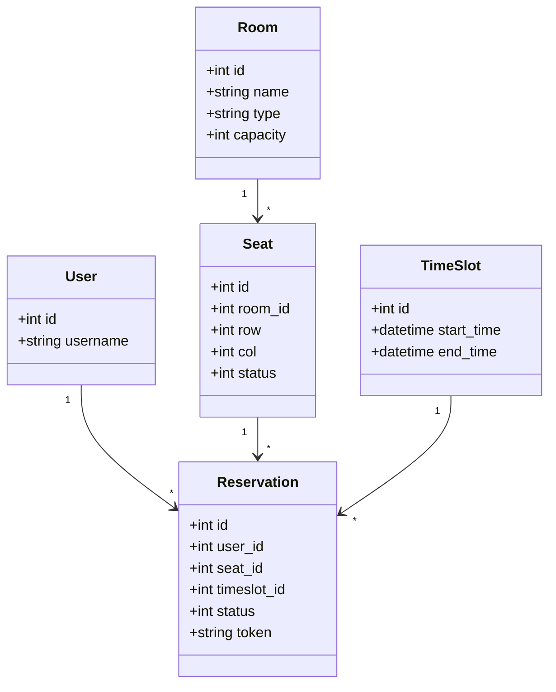
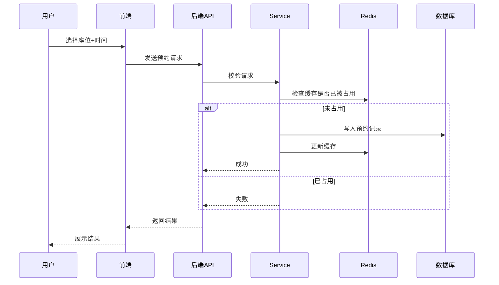
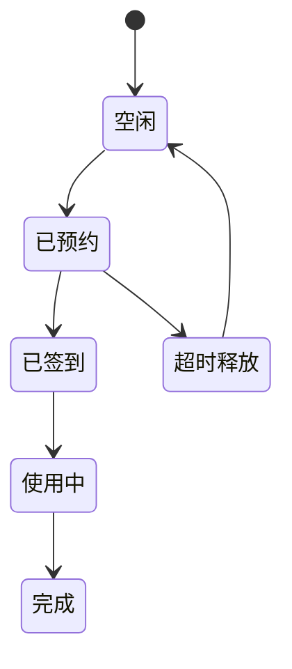

# 座位预约系统软件工程文档（增强版）

---

# 一、UML设计

## 1. 类图（Class Diagram）



---

## 2. 时序图（Sequence Diagram）

### 用户预约流程



---

## 3. 状态图（State Diagram）



---

# 二、接口文档（Swagger风格）

## 1. 通用说明

### Base URL
```
http://localhost:8080/api
```

### 统一返回格式
```json
{
  "code": 0,
  "message": "success",
  "data": {}
}
```

---

## 2. 用户模块

### 2.1 登录

**POST /user/login**

#### 请求参数
```json
{
  "username": "string",
  "password": "string"
}
```

#### 响应
```json
{
  "code": 0,
  "message": "success",
  "data": {
    "token": "xxx"
  }
}
```

---

## 3. 房间模块

### 3.1 获取房间列表

**GET /rooms**

#### 响应
```json
{
  "data": [
    {
      "id": 1,
      "name": "A101",
      "capacity": 100
    }
  ]
}
```

---

## 4. 座位模块

### 4.1 获取座位布局

**GET /rooms/{room_id}/seats**

#### 响应
```json
{
  "data": [
    {
      "id": 1,
      "row": 1,
      "col": 2,
      "status": 0
    }
  ]
}
```

---

## 5. 预约模块

### 5.1 创建预约

**POST /reservations**

#### 请求参数
```json
{
  "seat_id": 1,
  "timeslot_id": 2
}
```

#### 响应
```json
{
  "code": 0,
  "message": "预约成功"
}
```

---

### 5.2 取消预约

**POST /reservations/cancel**

#### 请求参数
```json
{
  "reservation_id": 1
}
```

---

### 5.3 我的预约

**GET /reservations/my**

---

## 6. 签到模块

### 6.1 用户签到

**POST /reservations/checkin**

#### 请求参数
```json
{
  "reservation_id": 1
}
```

---

# 三、补充（工程级增强）

## 1. 错误码设计

| code | 含义 |
|------|------|
| 0 | 成功 |
| 1001 | 未登录 |
| 1002 | 参数错误 |
| 2001 | 座位已被占用 |
| 2002 | 重复预约 |

---

## 2. 权限设计

- Token放入Header
```
Authorization: Bearer xxx
```

---

## 3. 并发安全说明

- Redis分布式锁
- 数据库唯一索引（seat_id + timeslot_id）

---

# 四、总结

本版本文档已达到：
- UML完整（三大核心图）
- 接口文档可直接用于Swagger实现
- 可直接进入开发阶段

适用于：课程设计 / 毕设 / 面试项目

